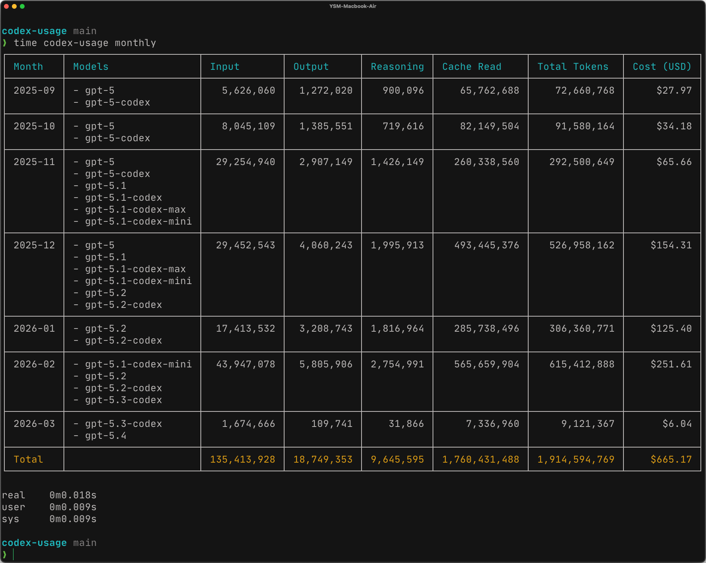

# codex-usage

An OpenAI Codex CLI usage report tool for tokens and cost, significantly faster than ccusage/codex offline mode by about 350x, built with Go.



## Features

- `daily`: Daily aggregation
- `monthly`: Monthly aggregation

The default log path is `~/.codex/sessions` (or `$CODEX_HOME/sessions`).  
The cache is stored under `~/.codex/codex-usage/`.

## Usage

### Build from source

```bash
# Build
go build -o bin/codex-usage ./cmd/codex-usage

# Run
./bin/codex-usage daily
./bin/codex-usage monthly
```

### Install with go install

```bash
# Install
go install github.com/ilcm96/codex-usage/cmd/codex-usage@latest

# Run
codex-usage daily
codex-usage monthly
```

## Options

- `--color`: Force-enable colored output (default: auto)
- `-h/--help`, `-v/--version`
